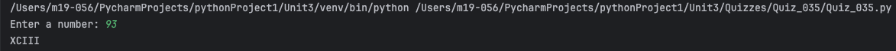
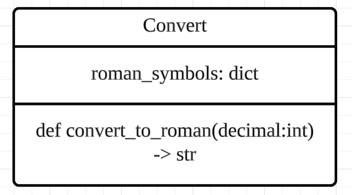
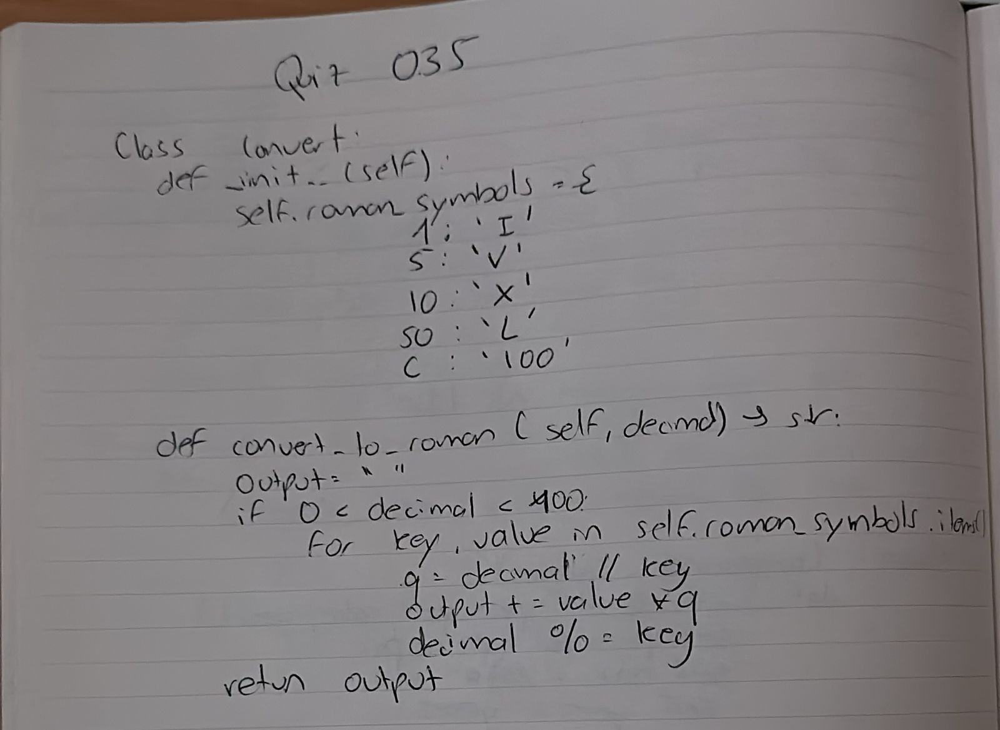

# Quiz 035
## A class named Converter. The class initializes with a dictionary with key decimal numbers and values the letters of the Roman numeral system. No inputs in the initializer.
### Python code
```.py
class Convert:
    def __init__(self):
        self.roman_symbols = {
            100: 'C',
            90: 'XC',
            50: 'L',
            40: 'XL',
            10: 'X',
            9: 'IX',
            5: 'V',
            4: 'IV',
            1: 'I'
        }

    def convert_to_roman(self, decimal) -> str:
        output = ""
        if 0 < decimal < 400:
            for key, value in self.roman_symbols.items():
                q = decimal // key
                output += value * q
                decimal %= key
        return output
```


### Proof


*Fig.1* Quiz 035 Proof Image

### UML Diagram


*Fig.2* Quiz 035 UML Diagram Image

### Paper work

*Fig.3* Quiz 035 Paper work