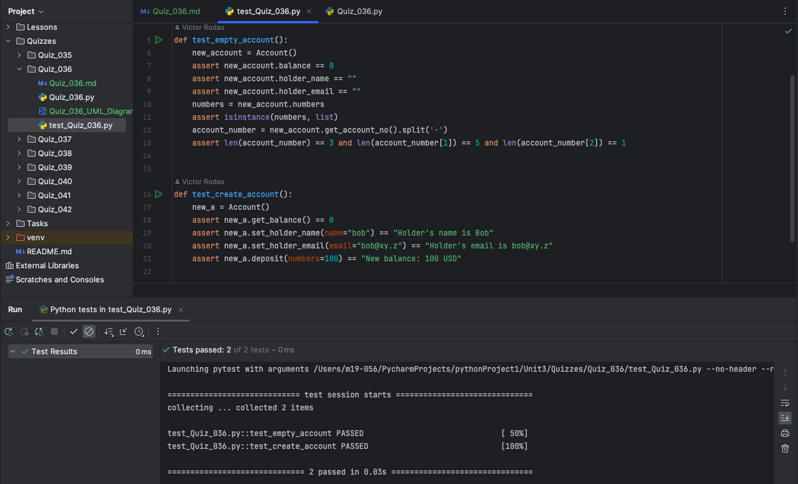
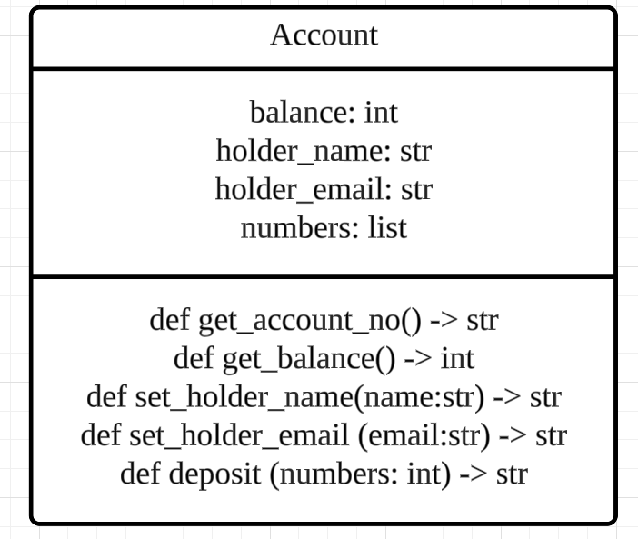
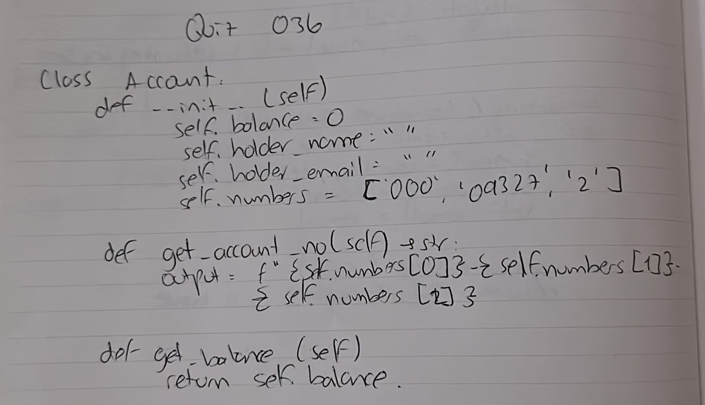

# Quiz 036
## Bank account
### Python code
```.py
class Account:
    def __init__(self):
        self.balance = 0
        self.holder_name = ""
        self.holder_email = ""
        self.numbers = ['000', '09327', '2']

    def get_account_no(self) -> str:
        output = f"{self.numbers[0]}-{self.numbers[1]}-{self.numbers[2]}"
        return output

    def get_balance(self):
        return self.balance

    def set_holder_name(self, name):
        self.holder_name = name
        output = f"Holder's name is {self.holder_name.title()}"
        return output

    def set_holder_email(self, email):
        self.holder_email = email
        output = f"Holder's email is {self.holder_email}"
        return output

    def deposit(self, numbers):
        self.amount = numbers
        output = f"New balance: {self.amount} USD"
        return output
```

### Proof

*Fig.1* Quiz 036 Proof Image with testing code

### UML Diagram
]
*Fig.2* Quiz 036 UML Diagram

### Paper work

*Fig.3* Quiz 036 Work on paper