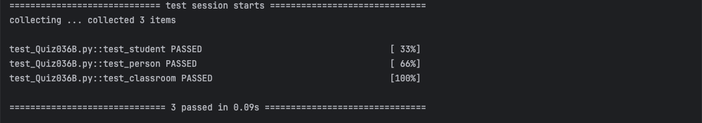

# Quiz_036B
## Create test cases for the classes below ② UML diagram. ③ Add another class Classroom which can store in a list student　objects, a method to add, remove students and method to calculate the average score
### Python code
```.py
class Person:
    def __init__(self, name, age):
        self.name = name
        self.age = age

    def get_name(self):
        if not isinstance(self.name, str):
            raise ValueError("Error. Input should be a string")
        return self.name

    def get_age(self):
        if not isinstance(self.age, int):
            raise ValueError("Error. Input must be a integer")
        return self.age


class Student(Person):
    def __init__(self, name, age, grade):
        super().__init__(name, age)
        self.grade = grade

    def get_grade(self):
        return self.grade


class Classroom:
    def __init__(self):
        self.students = []

    def add_student(self, student: Student):
        self.students.append(student)

    def remove_student(self, student: Student):
        if student not in self.students:
            raise ValueError("Student not in classroom")
        self.students.remove(student)

    def average_score(self, ):
        if len(self.students) == 0:
            raise ValueError("There is no one in this classroom")
        i = 0
        for student in self.students:
            i += student.get_grade()
        return i / len(self.students)
```

### Test Code
```.py
import pytest
from Quiz_036B import Person, Classroom, Student


def test_student():
    student = Student("Victor", 18, 95)
    assert student.get_name() == "Victor"
    assert student.get_age() == 18
    assert student.get_grade() == 95
    with pytest.raises(ValueError):
        student = Student(123, 20, 90)
        student.get_name()


def test_person():
    person = Person("John", 20)
    assert person.get_name() == "John"
    assert person.get_age() == 20
    with pytest.raises(ValueError):
        person2 = Person(123, "John")
        person2.get_name()
        person2.get_age()


def test_classroom():
    classroom = Classroom()
    student1 = Student("Victor", 18, 95)
    student2 = Student("Rocky", 16, 100)
    student3 = Student("Jenda", 15, 80)
    classroom.add_student(student1)
    classroom.add_student(student2)
    assert classroom.average_score() == (95 + 100) / 2
    classroom.remove_student(student1)
    assert classroom.average_score() == 100
    with pytest.raises(ValueError):
        classroom.remove_student(student3)
        classroom.average_score()
    with pytest.raises(ValueError):
        classroom.remove_student(student1)
        classroom.remove_student(student2)
        classroom.average_score()
```

### Proof

*Fig.1* Quiz 036B proof

### Work Paper

*Fig.2* Quiz 036B Work on paper