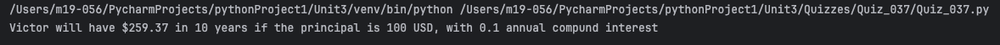
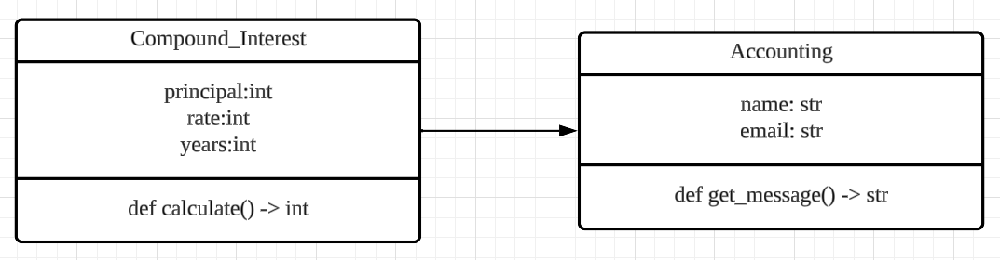
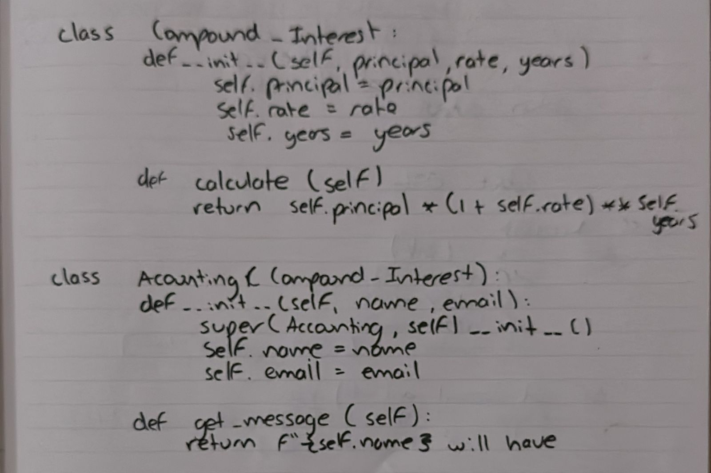

# Quiz 037
## A CompoundInterest class is used to calculate the compound interest of a given principal, rate and number of years with the equation principal * (1 + rate) ** years
### Python code
```.py
class Compound_Interest:
    def __init__(self, principal, rate, years):
        self.principal = principal
        self.rate = rate
        self.years = years

    def calculate(self):
        return self.principal * (1 + self.rate/12) ** (self.years*12)

class Accounting(Compound_Interest):
    def __init__(self, name, email, principal, rate, years):
        super(Accounting, self).__init__(principal, rate, years)
        self.name = name
        self.email = email

    def get_message(self):
        return f"{self.name} will have ${self.calculate():.2f} in {self.years} years if the principal is {self.principal} USD, with {self.rate} annual compund interest"

```

### Proof

*Fig.1* Quiz 037 proof image

### UML Diagram

*Fig.2* Quiz 037 UML Diagram

### Work Paper

*Fig.3* Quiz 037 Work on paper