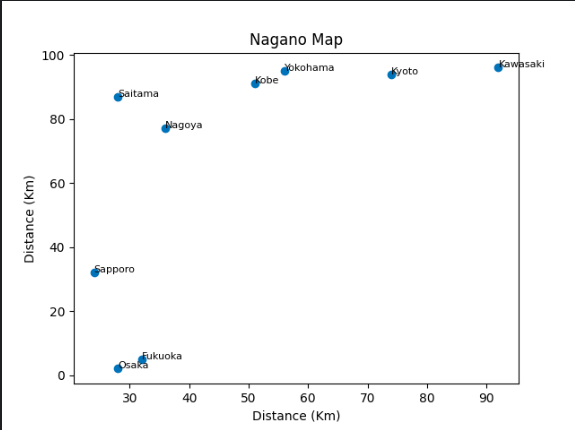
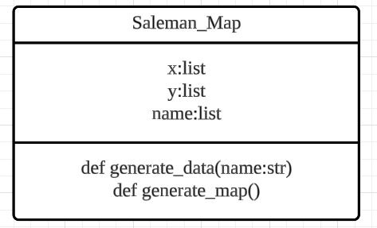

# Quiz 038
## Create a program that creates the SalemanMap using your OOP code
### Python code
```.py
import matplotlib.pyplot as plt
import random
class Saleman_Map:
    def __init__(self):
        self.x = []
        self.y = []
        self.name = []

    def generate_data(self, name):
        self.name = name
        for i in range(len(name)):
            self.x.append(random.randint(0, 100))
            self.y.append(random.randint(0, 100))

    def generate_map(self):
        plt.scatter(self.x, self.y)
        for i, city in enumerate(self.name):
            plt.text(self.x[i], self.y[i], city, fontsize=8)

        plt.title('Nagano Map')
        plt.xlabel('Distance (Km)')
        plt.ylabel('Distance (Km)')
        plt.show()
```

### Proof

*Fig.1* Quiz 038 proof image

### UML Diagram

*Fig.2* Quiz 038 UML Diagram