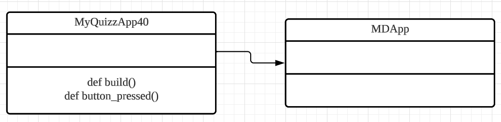

# Quiz 040
## Write a program that creates the GUI below:
### Python code
```.py
from kivymd.app import MDApp

class MyQuizzApp40(MDApp):
    def build(self):
        self.theme_cls.theme_style = "Dark"
        return

    def button_pressed(self):
        if self.theme_cls.theme_style == "Dark":
            self.theme_cls.theme_style = "Light"
        else:
            self.theme_cls.theme_style = "Dark"
        btn = self.root.ids.my_btn
        if btn.md_bg_color == [0, 0, 1, 1]:
            btn.md_bg_color = "red"
            self.root.ids.my_btn.text = "Light mode"
        else:
            btn.md_bg_color = "blue"
            self.root.ids.my_btn.text = "Dark mode"

text = MyQuizzApp40()
text.run()
```

### Kivymd Code
```.py
Screen:
    size: 500, 500

    MDLabel:
        id:my_label
        text: "Victor Rodas"
        font_size: "30pt"
        halign: "center"

    MDRaisedButton:
        id:my_btn
        text: "Dark mode"
        size_hint: 0.1, 0.1
        pos_hint: {"center_x" : 0.05, "center_y": 0.03}
        color: "white"
        md_bg_color: "blue"
        on_press:
            app.button_pressed()
```

### Proof
[Quiz_040_Proof.mov](Quiz_040_Proof.mov)
*Vid.1* Quiz 040 video proof

### UML Diagram

*Fig.1* Quiz 040 UML Diagram