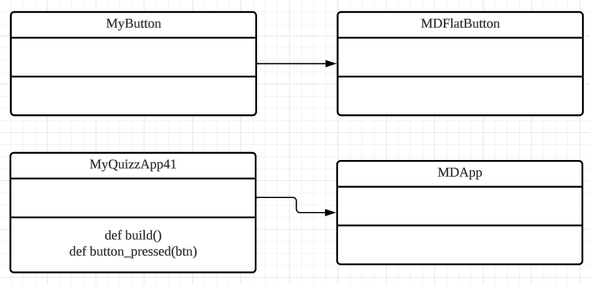

# Quiz 041
## Write a program that creates the GUI below:
### Python Code
```.py
class MyButton(MDFlatButton):
    pass
class MyQuizzApp41(MDApp):
    def build(self):
        Window.size = (500, 500)
        pass
    def button_pressed(self, btn):
        btn.md_bg_color = "red"
        if self.root.ids.player_turn.text == "X player's turn":
            btn.text = "X"
            self.root.ids.player_turn.text = "Y player's turn"
        else:
            self.root.ids.player_turn.text = "X player's turn"
            btn.text = "O"
            btn.md_bg_color = "yellow"


test = MyQuizzApp41()
test.run()
```

### Kivymd code
```.py
Screen:
    size: 500, 500
    MDBoxLayout:
        size_hint: 0.8, 0.8
        pos_hint: {"center_x":0.5, "center_y":0.5}
        md_bg_color:"black"
        orientation: "vertical"


        MDBoxLayout:
            orientation: "horizontal"
            size_hint: 1, 0.25
            md_bg_color:"white"


            MDLabel:
                id: player_turn
                text: "X player's turn"
                font_size: "24pt"
                halign: "center"

        MDBoxLayout:
            orientation: "horizontal"
            size_hint: 1, 0.25
            md_bg_color:"yellow"
            MyButton:
            MyButton:
            MyButton:

        MDBoxLayout:
            orientation: "horizontal"
            size_hint: 1, 0.25
            md_bg_color:"white"
            MyButton:
            MyButton:
            MyButton:

        MDBoxLayout:
            orientation: "horizontal"
            size_hint: 1, 0.25
            md_bg_color:"yellow"
            MyButton:
            MyButton:
            MyButton:

<MyButton>:
    size_hint: 1, 1
    color: "white"
    md_bg_color:"blue"
    font_size: "48pt"
    on_press:
        app.button_pressed(self)
```

### Proof
[Quiz_041_Proof.mov](Quiz_041_Proof.mov)
*Vid.1* Quiz 041 video proof

### UML Diagram

*Fig.1* UML Diagram