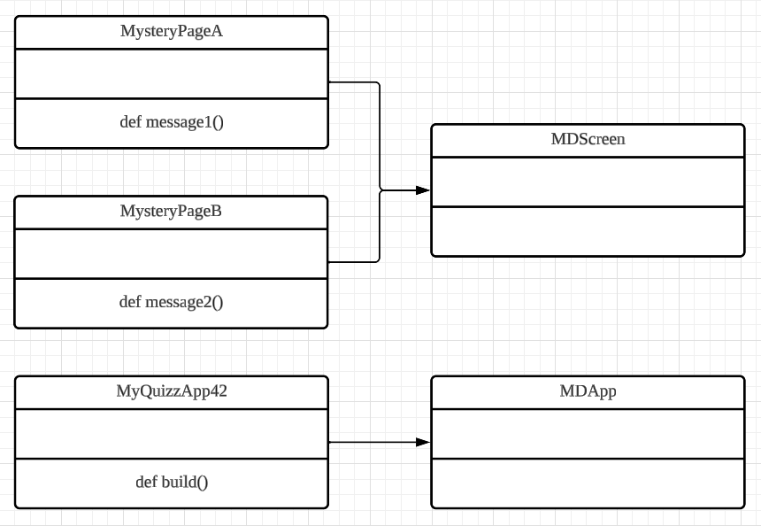

# Quiz 042
## Write a program that creates the GUI described by the UML diagram for classes below:
### Python code
```.py
class MysteryPageB(MDScreen):
    def message2(self):
        self.parent.current = "First"
        print("This is mystery page A you pressed the button")
class MysteryPageA(MDScreen):
    def message1(self):
        self.parent.current = "Second"
        print("This is mystery page B you pressed the button")
class MyQuizApp42(MDApp):
    def build(self):
        Window.size = (900, 900)
```

### Kivymd code
```.py
ScreenManager:
    MysteryPageA:
        name: "First"
    MysteryPageB:
        name: "Second"

<MysteryPageA>:
    MDLabel:
        text: "This is MysteryPageA"
        font_size: "32pt"
        halign: "center"
    MDFloatingActionButton:
        icon: "pencil-outline"
        style: "standard"
        on_press:
            root.message1()
<MysteryPageB>:
    MDLabel:
        text: "This is MysteryPageB"
        font_size: "32pt"
        halign: "center"
    MDFloatingActionButton:
        icon: "pencil-outline"
        style: "standard"
        on_press:
            root.message2()
```

### Proof
[Quiz_042_Proof.mov](Quiz_042_Proof.mov)
*Vid.1* Quiz 042 proof video

### UML Diagram

*Fig.1* Quiz 042 UML Diagram