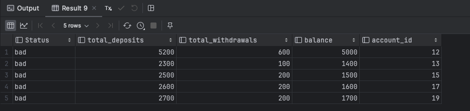
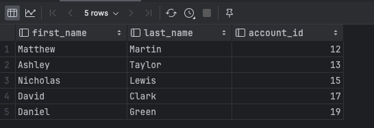

# Quiz 045
## Download the database brokenbank.db from the learning Log, and write the SQL statements to solve mystery of the transaction that bankrupted the bank:
### SQL Code
```sql
SELECT
  CASE
    WHEN total_deposits - total_withdrawals != balance THEN 'bad'
    ELSE 'good'
  END AS 'Status',
  total_deposits,
  total_withdrawals,
  balance,
  account_id

FROM (
  SELECT
    SUM(amount) AS total_deposits,
    account_id AS a_d_id
  FROM transactions
  WHERE transaction_type = 'deposit'
  GROUP BY account_id
),

(
  SELECT
    SUM(amount) AS total_withdrawals,
    account_id AS a_w_id
  FROM transactions
  WHERE transaction_type = 'withdraw'
  GROUP BY account_id
),

accounts
WHERE a_d_id = a_w_id
    AND a_d_id = accounts.account_id
    AND Status = "bad";

SELECT customers.first_name, customers.last_name, accounts.account_id
FROM customers
JOIN accounts
ON customers.customer_id = accounts.customer_id
WHERE accounts.account_id IN (12, 13, 15, 17, 19);
```

### Proof


*Fig.1* The SQL code to solve the mystery of the transaction that bankrupted the bank



*Fig.2* The results of the SQL code


### ER Diagram


*Fig.3* The ER Diagram of the database
