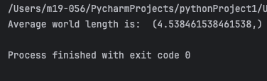
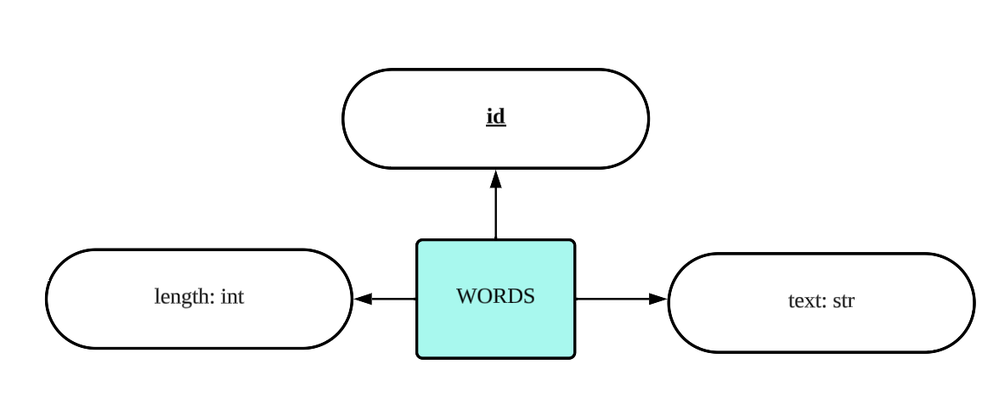

# Quiz 046
## A company requires a program that calculates the average word length from a database of words. Complete the following code:
### Python code:
```python
from Lessons.Lesson_Library_Login import DatabaseWorker

haiku = """Code flows like a stream
algorithms guide its way
in silence, it solves"""

db = DatabaseWorker("Quiz046.db")
db.create()

# for word in haiku.split():
#     query = f"""INSERT INTO Words (text, length) VALUES ('{word}', {len(word)})"""
#     db.insert(query)
out = db.search("""SELECT avg(length) FROM Words""")
print("average world length is: " , out)

db.close()
```

### Proof Image



*Fig.1* Proof Image Quiz 046


### ER Diagram



*Fig.2* ER Diagram
