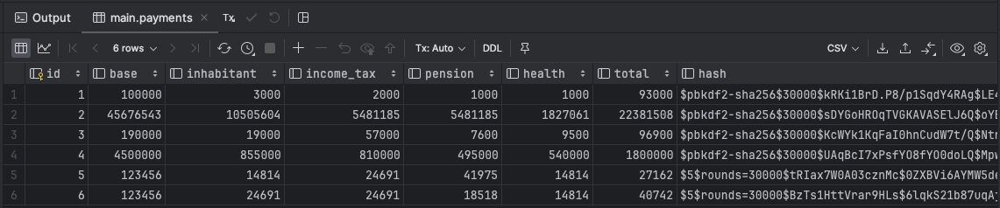
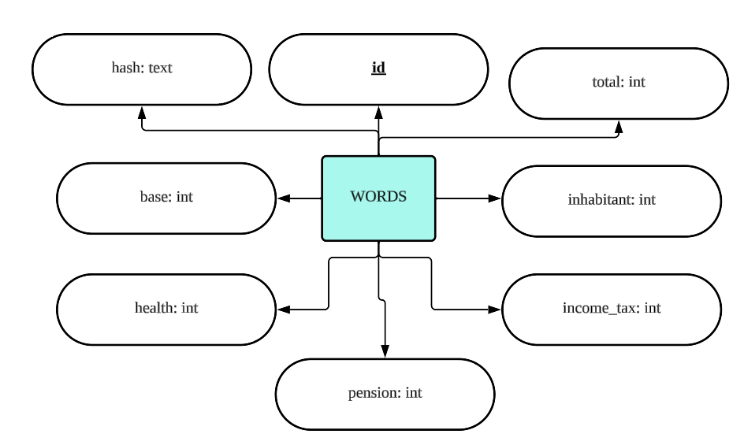

# Quiz 047
## Use the Handout for Quiz 047, and the starting files quiz047.py quiz047.kv, payments.db: to create the application below:
### Python code

```python
from kivymd.app import MDApp
from Lessons.Lesson_Library_Login import DatabaseWorker, make_hash, check_hash


class quiz047(MDApp):
    def __init__(self, **kwargs):
        super().__init__(**kwargs)
        self.components = {"base": 0, "health": 0, "pension": 0, "income_tax": 0, "inhabitant": 0, "total": 0, "hash": ""}
        self.db_connection = DatabaseWorker("payments.db")

    def build(self):
        return

    def save(self):
        pass

    def update(self):
        #This function updates all the labels in the form using the base salary and the percentage
        # Pseudocode
        # 1- get the base salary from the GUI
        # 2- if base salary define total=int(base) and an empty string to store build a hash (for_hash="") if no base then end the function
        # 3- for Each TextField with ids: "inhabitant","income_tax","pension","health" get the text property
        # 4- if the TextField.text has a number (value), calculate the equation new_value="(base*int(value)//100) JPY" and subbctract the equation to the total
        # 5- if no: then new_value = " JPY"
        # 6- set the label next to the TextField (inhabitant_label, income_tax_label, etc) to the variable new_value
        # 7- concatenate to the hash variable the f"{id}{value}"
        # 8- set the text of the element id=total to the total with the JPY symbol
        # 9- encrypt the hash and change the text of the label with id=hash to the last 50 characters of the hash

        #calculate total
        ids = ["inhabitant", "income_tax", "pension", "health"]
        base = self.root.ids.base.text
        if base:
            base_int = int(base)
            pension = int(self.root.ids.pension.text or '0')
            health = int(self.root.ids.health.text or '0')
            income_tax = int(self.root.ids.income_tax.text or '0')
            inhabitant = int(self.root.ids.inhabitant.text or '0')

            pension_jpy = (base_int * pension) // 100
            health_jpy = (base_int * health) // 100
            income_tax_jpy = (base_int * income_tax) // 100
            inhabitant_jpy = (base_int * inhabitant) // 100
            self.root.ids.pension_label.text = f"{pension_jpy} JPY"
            self.root.ids.health_label.text = f"{health_jpy} JPY"
            self.root.ids.income_tax_label.text = f"{income_tax_jpy} JPY"
            self.root.ids.inhabitant_label.text = f"{inhabitant_jpy} JPY"
            total = base_int - pension_jpy - health_jpy - income_tax_jpy - inhabitant_jpy
            self.root.ids.salary_label.text = f"{total} JPY"
            hash = f"base{base_int},inhabitant{inhabitant},income_tax{income_tax},pension{pension},health{health},total{total}"

            self.components["hash"] = hash
            self.components["base"] = base_int
            self.components["inhabitant"] = inhabitant_jpy
            self.components["income_tax"] = income_tax_jpy
            self.components["pension"] = pension_jpy
            self.components["health"] = health_jpy
            self.components["total"] = total
        # update the percentage


    def save(self):
        hash = make_hash(self.components["hash"])
        base_int = self.components["base"]
        inhabitant_jpy = self.components["inhabitant"]
        income_tax_jpy = self.components["income_tax"]
        pension_jpy = self.components["pension"]
        health_jpy = self.components["health"]
        total = self.components["total"]


        query = f"""INSERT into payments(base, inhabitant, income_tax, pension, health, total, hash) 
        VALUES ({base_int}, {inhabitant_jpy}, {income_tax_jpy}, {pension_jpy}, {health_jpy}, {total}, '{hash}')

        """
        self.db_connection.run_query(query)

        self.root.ids.hash.text = f"Payment saved"

    def clear(self):
        for label in ["base", "inhabitant", "income_tax", "pension", "health"]:
            self.root.ids[label].text = ""
            self.root.ids[label+"_label"].text = " JPY"

        self.root.ids["salary_label"].text = " JPY"
        self.root.ids.hash.text = "----"


test = quiz047()
create = """CREATE TABLE if not exists payments(
    id INTEGER PRIMARY KEY,
    base INTEGER,
    inhabitant INTEGER,
    income_tax INTEGER,
    pension INTEGER,
    health INTEGER,
    total INTEGER,
    hash TEXT
    )"""
my_db = DatabaseWorker("payments.db")
my_db.run_query(create)

my_db.close()
test.run()
test.db_connection.close()
```

### Proof
[Quiz_047_Proof_Video.mov](Quiz_047_Proof_Video.mov)

*Vid.1* Proof of Quiz_047



*Fig.1* Proof of the table Quiz_047

### ER Diagram


*Fig.2* ER Diagram
