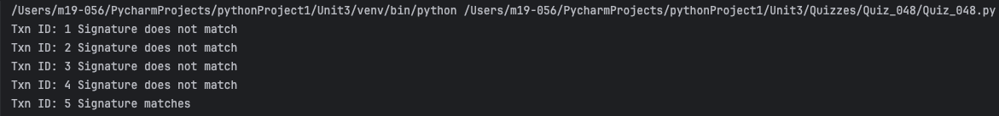
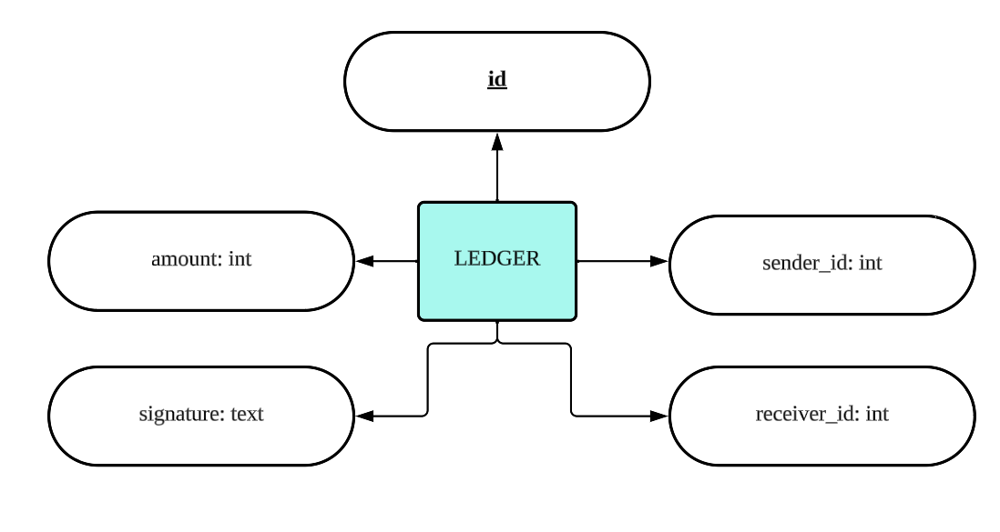

# Quiz 048
## Use the database bitcoin_exchange.db: and create a program that check the hash signature stored for every transaction and prints: Tx(id=1)Signature matches or  Tx(id=1)Error signature
### Python Code
```python
from Lessons.Lesson_Library_Login import DatabaseWorker, check_hash

query = """Select * from ledger"""

my_db = DatabaseWorker("bitcoin_exchange.db")
info = my_db.search(query, multiple=True)
for row in info:
    id = row[0]
    sender_id = row[1]
    receiver_id = row[2]
    amount = row[3]
    signature = row[4]

    hash = f'id {id},sender_id {sender_id},receiver_id {receiver_id},amount {amount}'
    if check_hash(hash, signature):
        print(f"Txn ID: {id} Signature matches")
    else:
        print(f"Txn ID: {id} Signature does not match")

my_db.close()
```

### Proof


*Fig.1* Proof Image for Quiz 048

### ER Diagram


*Fig.2* ER Diagram for Quiz 048