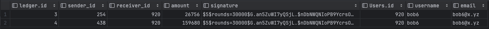

# Quiz 050
## In the database bitcoin_exchange.db: create a new table for the users, which attributes id, name, email. This table has a one-to-many relationship with the ledger in two columns (sender and receiver). Add users for all the ids in the ledger table. Create ER diagram. Create a query to get all the transactions involving user id= 920.
### Python code
```python
from Lessons.Lesson_Library_Login import DatabaseWorker

my_db = DatabaseWorker("../Quiz_049/bitcoin_exchange.db")
create_users = """CREATE TABLE IF NOT EXISTS Users(
                    id Integer primary key,
                    username TEXT NOT NULL unique,
                    email TEXT)"""

my_db.run_query(create_users)


# insert_query = """INSERT INTO Users (id, username, email) VALUES (560, 'bob', 'bob1@x.yz'), (371, 'bob2', 'bob2@x.yz'), (488, 'bob3', 'bob3@x.yz'),
# (561, 'bob4', 'bob4@x.yz'), (254, 'bob5', 'bob5@x.yz'), (920, 'bob6', 'bob6@x.yz'), (438, 'bob7', 'bob7@x.yz'), (744, 'bob8', 'bob8@x.yz'),
# (261, 'bob9', 'bob9@x.yz')"""
#
# my_db.run_query(insert_query)

connection_query = """Select * from ledger join Users on ledger.sender_id = users.id where ledger.sender_id = 920"""
connection_query2 = """Select * from ledger join Users on ledger.receiver_id = users.id where ledger.receiver_id = 920"""
```

### Proof


*Fig.1* Users table





*Fig.2* Proof of the query

### ER Diagram


*Fig.3* ER Diagram
