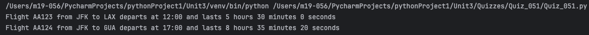
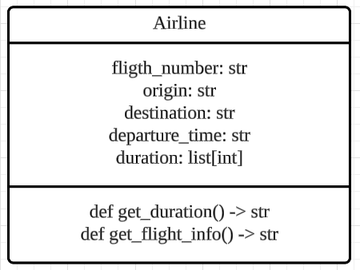

# Quiz 051
## Your task is to create a Python class to represent a flight offered by an airline ✈️. The class should have the following attributes:
### Python code
```python
class Airline:
    def __init__(self, flight_number: str, origin: str, destination: str, departure_time: str, duration: list[int]):
        self.flight_number = flight_number
        self.origin = origin
        self.destination = destination
        self.departure_time = departure_time
        self.duration = duration

    def get_duration(self):
        return f"{self.duration[0]} hours {self.duration[1]} minutes {self.duration[2]} seconds"

    def get_flight_info(self):
        return f"Flight {self.flight_number} from {self.origin} to {self.destination} departs at {self.departure_time} and lasts {self.get_duration()}"


flight = Airline("AA123", "JFK", "LAX", "12:00", [5, 30, 0])
print(flight.get_flight_info())

flight2 = Airline("AA124", "JFK", "GUA", "17:00", [8, 35, 20])
print(flight2.get_flight_info())
```

### Proof


*Fig.1* Quiz 051 Proof

### UML Diagram


*Fig.2* UML Diagram
